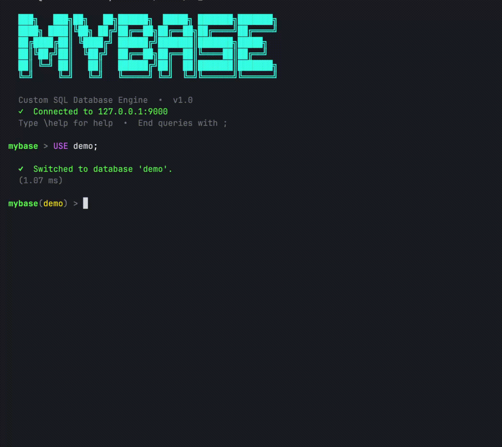
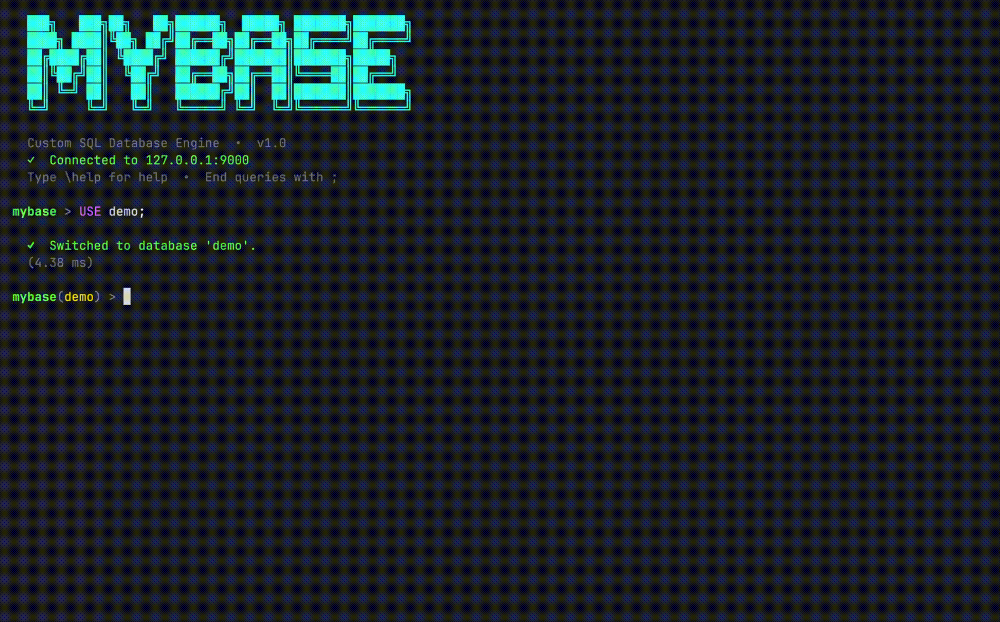
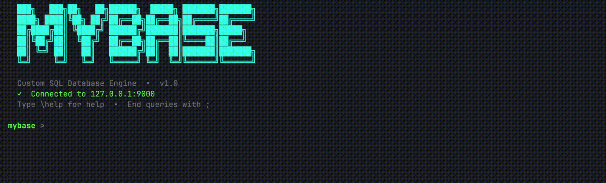
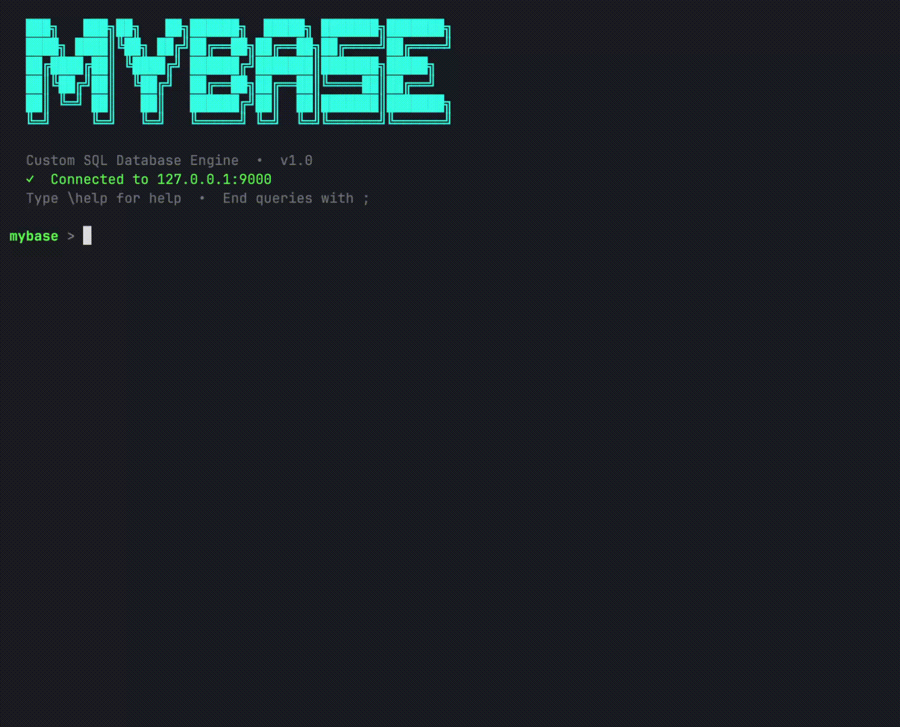
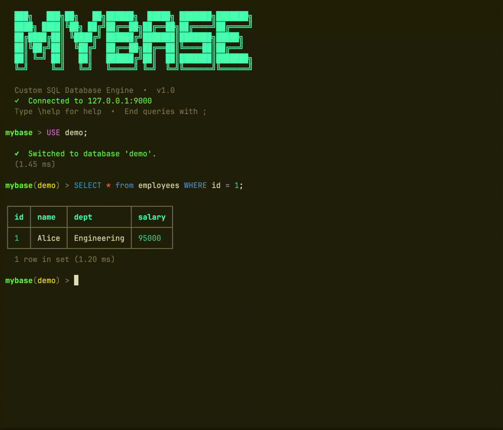

# MyBase 

Реляционная СУБД с SQL-подобным языком запросов, написанная на C++17 с нуля.
Клиент-серверная архитектура по TCP, персистентное хранилище в формате JSONL,
богатый консольный интерфейс с подсветкой синтаксиса и автодополнением.



---

## Возможности

### Базовый SQL

| Категория | Поддержка |
|---|---|
| DDL | `CREATE`/`DROP DATABASE`, `CREATE`/`DROP TABLE` |
| DML | `SELECT`, `INSERT`, `UPDATE`, `DELETE` |
| Фильтрация | `WHERE` с `AND`, `OR`, `NOT`, вложенными скобками |
| Типы данных | `INT`, `FLOAT`, `BOOL`, `TEXT`, `VARCHAR(N)` |


### Расширенный функционал
- **Транзакции** — `BEGIN`, `COMMIT`, `ROLLBACK`
- **Агрегатные функции** — `COUNT`, `SUM`, `MIN`, `MAX`, `AVG`
- **GROUP BY** — группировка с агрегацией
- **ORDER BY ASC/DESC** — сортировка результата
- **LIMIT / OFFSET** — пагинация
- **Многострочный INSERT** — `INSERT INTO t VALUES (…), (…), (…)`
- **Именованные колонки в INSERT** — `INSERT INTO t (a, b) VALUES (…)`
- **Импорт и экспорт (CSV)** — `EXPORT TABLE <t> TO '<p>'` и `IMPORT TABLE <t> FROM '<p>'` для миграции и бэкапов
- **Многопоточность** — каждое TCP-соединение обслуживается в отдельном потоке

### CLI-интерфейс



- Подсветка синтаксиса в реальном времени (DML, DDL, клаузы, типы, литералы — разными цветами)
- Автодополнение по Tab (все SQL-ключевые слова)
- Инлайн-подсказки при наборе
- Персистентная история команд (`~/.mybase_history`)
- Многострочный ввод — запрос выполняется при вводе `;`
- Промпт с именем активной базы: `mybase(shop) >`
- Таблицы с Unicode-рамками, цветные NULL и числа, время выполнения запроса



- Встроенные команды: `\help`, `\clear`, `\history`, `\status`, `\quit`

---

## Быстрый старт

### Сборка

```bash
./build.sh
```

Скрипт определяет ОС, устанавливает зависимости через системный менеджер пакетов
(brew / apt / pacman / dnf / yum / zypper) и собирает проект через CMake.
Результат — папка `build/` с исполняемыми файлами и библиотеками.

### Запуск сервера

```bash
./run.sh --host 127.0.0.1 --port 9000
```

### Запуск клиента

```bash
./build/db_client --host 127.0.0.1 --port 9000
```

---

## Примеры

### Создание базы и таблицы

```sql
CREATE DATABASE shop;
USE shop;
CREATE TABLE products (id INT, name VARCHAR(64), price FLOAT, active BOOL);
```



### Вставка и выборка

```sql
INSERT INTO products VALUES
  (1, 'Widget', 9.99, true),
  (2, 'Gadget', 49.95, true),
  (3, 'Doohickey', 4.50, false);

SELECT * FROM products ORDER BY price DESC;
```

```
┌────┬───────────┬───────┬────────┐
│ id │ name      │ price │ active │
├────┼───────────┼───────┼────────┤
│ 2  │ Gadget    │ 49.95 │ true   │
│ 1  │ Widget    │ 9.99  │ true   │
│ 3  │ Doohickey │ 4.5   │ false  │
└────┴───────────┴───────┴────────┘
  3 rows in set (0.42 ms)
```

### Импорт и экспорт (CSV)

Выгрузка данных из СУБД во внешний файл и их последующее восстановление:

```sql
-- Экспортируем данные таблицы в CSV-файл на сервере
EXPORT TABLE products TO './products_backup.csv';

-- Удаляем таблицу для проверки персистентности
DROP TABLE products;

-- Пересоздаем пустую структуру
CREATE TABLE products (id INT, name VARCHAR(64), price FLOAT, active BOOL);

-- Импортируем данные обратно из файла
IMPORT TABLE products FROM './products_backup.csv';

```sql

### Агрегации

SELECT COUNT(id), AVG(price), MAX(price) FROM products WHERE active = true;
```

### Транзакции



```sql
BEGIN;
UPDATE products SET price = 0.01 WHERE id = 2;
ROLLBACK;
-- цена Gadget не изменилась
```

---

## Архитектура

### Структура проекта

```
MyBase/
├── include/
│   ├── db_core/          # Ядро: типы, лексер, парсер, команды, хранилище
│   ├── db_client_lib/    # Публичный API клиентской библиотеки
│   └── db_server/        # Протокол, TCP-сервер, обработчик запросов
├── src/
│   ├── db_core/          # Реализация ядра
│   ├── db_client/        # main.cpp консольного клиента
│   ├── db_client_lib/    # TcpDbConnection
│   └── db_server/        # main.cpp сервера, TCP, протокол
├── tests/                # Google Test: лексер, парсер, SELECT, транзакции
├── data/                 # Персистентные данные (JSONL, создаётся автоматически)
├── build.sh              # Скрипт сборки
└── run.sh                # Скрипт запуска сервера
```

### Поток запроса

```
Пользователь вводит SQL
        │
        ▼
   db_client/main.cpp
   (prepend USE db; если база выбрана)
        │  TCP
        ▼
   TcpServer (отдельный поток на соединение)
        │
        ▼
   BinaryProtocol::parseRequest
        │
        ▼
   SqlRequestHandler::handle
   Lexer -> Parser -> Command
        │
        ▼
   DatabaseManager (под мьютексом)
        │
        ▼
   JsonFileStorageEngine::saveAll
        │  TCP
        ▼
   BinaryProtocol::serializeResponse
        │
        ▼
   db_client: printResult (таблица / сообщение)
```

### Применённые паттерны

| Паттерн | Где применён | Зачем |
|---|---|---|
| **Command** | `Command` и его наследники в `commands.h` | Каждый SQL-запрос — объект с методом `execute`. Парсер производит команды, не зная, кто их выполнит. Позволяет легко добавлять новые запросы. |
| **Strategy** | `StorageEngine`, `Logger`, `Protocol` | Реализации (JSON/файл, консоль/файл, бинарный протокол) подключаются через интерфейс, не меняя ядро. |
| **Singleton** | `DatabaseManager` | Единственный экземпляр разделяется между всеми потоками; инициализируется один раз при старте сервера. |

### Формат хранилища

Данные хранятся в `./data/<db>/<table>.jsonl`:
- Первая строка файла — JSON-массив схемы колонок
- Каждая следующая строка — JSON-массив значений одной строки таблицы

```jsonl
[{"name":"id","type":"INT"},{"name":"name","type":"VARCHAR"},{"name":"price","type":"FLOAT"}]
[1,"Widget",9.99]
[2,"Gadget",49.95]
```

Формат намеренно человекочитаемый: данные можно посмотреть и отредактировать
в любом текстовом редакторе без специальных инструментов.

---

## Сборочные артефакты

| Файл | Тип | Назначение |
|---|---|---|
| `build/db_server` | Исполняемый файл | TCP-сервер СУБД |
| `build/db_client` | Исполняемый файл | Консольный клиент |
| `build/libdb_core.a` | Статическая библиотека | Ядро: парсер, движок, хранилище |
| `build/libdb_client_lib.a` | Статическая библиотека | API для клиентского кода |

Клиентский код обращается к СУБД исключительно через `db_client_lib` —
прямого доступа к файлам хранилища или внутренним структурам ядра нет.

---

## Тесты

```bash
./build/db_tests
```

35 тестов покрывают: лексер, парсер, все виды SELECT (ORDER BY, LIMIT, OFFSET,
агрегаты, GROUP BY), транзакции, персистентность, многопоточную вставку.
